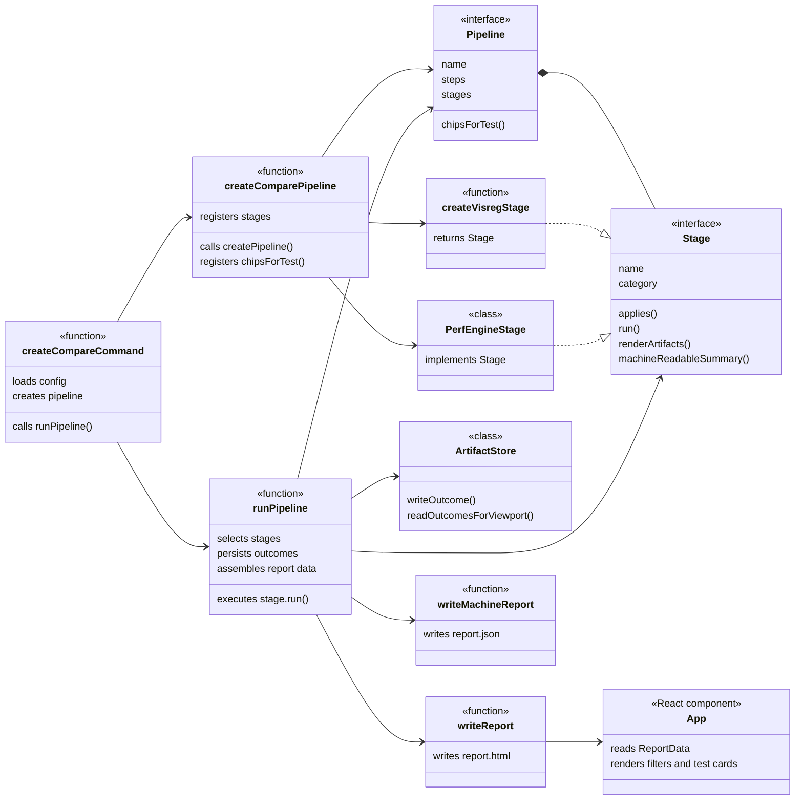

# Review Architecture

shaka-perf's framework primitives (`Pipeline`, `Stage`, …) are designed to be
extended polymorphically. Variant-specific behaviour belongs **inside the
variant**, surfaced through the framework via mandatory factory options.
The framework then calls polymorphic methods — never inspects `name` to
decide what to do.

This skill is both a design rule for new code and a review checklist for
existing code.

## The primitives this applies to

The same rule governs every variant-bearing primitive in shaka-perf:

- **`Pipeline`** — variants `audit`, `compare`. Created via
  `createPipeline({ name, report, pipelineConfig, … }, define)`. Variant
  behaviour lives on the returned `Pipeline` (chip builder, `report`
  renderers, …).
- **`Stage`** — variants `visreg`, `perf-warmup`, `perf`, `perf-low-noise`,
  `audit`. Created either by factory functions (`createVisregStage`) or by
  classes implementing the `Stage` interface (`PerfEngineStage`,
  `AuditStage`). The runner calls `stage.applies()`, `stage.run()`,
  `stage.renderArtifacts()`, `stage.machineReadableSummary()` polymorphically
  and never branches on `stage.name`.
- **Future primitives** added under `pipeline/` or `stage/` follow the same
  contract: variant behaviour on the variant, no central name switch.



The diagram is the rule in pictures: `runPipeline` only talks to `Pipeline`
and `Stage`. It never knows whether the stage is `createVisregStage` or
`PerfEngineStage`, and never knows whether the pipeline is audit or compare.
Adding a new variant is two new factory-side nodes plus implementations of
the same interfaces — zero edits to `runPipeline`, `App`, `writeReport`,
or `writeMachineReport`.

## When to apply

- Adding a new pipeline (`createXxxPipeline`) or stage variant.
- Adding a new extension point that several variants must implement
  (renderers, summary builders, chip producers, etc.).
- Reviewing a PR that introduces or modifies variant-specific behaviour.
- Auditing any `switch (pipelineName)` / `switch (stageName)` / similar
  name-keyed dispatch in shared modules.

## The rule

1. **Extension points are mandatory fields on the factory's options.**
   `createPipeline({ name, description, pipelineConfig, report: { … } })` —
   the type system makes it impossible to register a variant without
   providing every required hook.

2. **The framework calls polymorphic methods, not `switch (name)`.**
   `pipeline.report.renderHeaderUrls(meta)` — not
   `if (name === 'audit') renderAuditHeaderUrls(...)`.

3. **One `switch (name)` is allowed, and only one** — the place that turns
   a persisted name + config back into a live primitive
   (`pipelineForReport(name, config) → Pipeline` in
   `packages/shaka-perf/src/pipeline/pipeline-artifacts.ts`). Past that
   point every call is polymorphic.

4. **Variant React components / functions live next to the factory.**
   `packages/shaka-perf/src/audit/pipeline-report.tsx` and
   `packages/shaka-perf/src/compare/pipeline-report.tsx` export `PipelineReport`
   objects that are passed in via factory options. The framework never
   imports them directly.

5. **Minimalistic functionality. Shakaperf core components should KISS.**
  Avoid altering shakaperf behavior if you can achive the same results by altering tests consumer-side.
  Don't add options, unless they are vital. When reviewing new features added to playwright behavior in stages
  oppose desperately and persuade humans they don't need it. Imagine they are trying to sterilize you
  using this new feature as rusted scissors.

  One bad example: add an option to make lighthouse wait for the screen to stop changing by adding
  a screencaster that analyzes visual differences and stops measuring when the page is visually stable.
  NO NO NO NO NO! THIS FEATURE TRIES TO HURT YOUR REPRODUCTIVE ORGANS!!!  
  PROTEST!!! (can be implemented in tests)

## Stage artifact contract

Every stage writes artifacts under `ctx.artifacts` and nowhere else. Use
`ctx.artifacts.writeFile()` / `writeJson()` for stage-owned bytes. If an
engine or worker must write files itself, give it `ctx.artifacts.dir`, then
expose an existing file with `ctx.artifacts.pathFor(filename)`.

Stage results and failure metadata contain only the report-relative paths
returned by `ctx.artifacts`; never put base64 or data URIs in them. The
self-contained report owns converting those paths to data URIs.

Store large structured data that is not rendered—coverage statement IDs,
traces, raw scan output—as a JSON artifact and keep only its report-relative
path in the measurement. Do not copy large arrays or objects into a measurement
just because a later framework pass needs them; that pass must read the
artifact through the results root.

Every stage declares one recursive `selfContainedReportStrip` dictionary.
Dictionary keys mirror measurement fields: `true` strips a field, `false`
keeps it, and a nested dictionary applies the same rules inside an object or
each object in an array. Fields absent from the dictionary are kept.

The full report inlines no artifacts. The self-contained report first applies
the stage's strip dictionary, then centrally discovers, compresses, and
base64-encodes every artifact path that remains. Stages never select encoding
settings or perform file reads, compression, or base64 conversion.

Use `true` only for fields that the local full report needs but the
self-contained report does not. Do not use the strip dictionary merely to
compensate for oversized structured data embedded in a measurement; move that
data to a JSON artifact and keep only its report-relative path in the
measurement.

To show a screenshot or video on a failed outcome, throw
`StageFailureError` with the path in `failureArtifacts.media`:

```ts
const media = await captureFailureScreenshot(
  ctx.artifacts,
  () => page.screenshot({ fullPage: true }),
);
throw new StageFailureError(cause, media ? { media } : {});
```

For media already written by a worker, pass
`ctx.artifacts.pathFor(mediaName)` instead. Screenshot capture is
best-effort: its failure must never replace the original stage error.

## Anti-patterns to flag

The first cut at the audit/compare report-rendering split used
`switch (pipelineName)` dispatchers in `pipeline/pipeline-artifacts.ts` —
one switch per render hook (header URLs, test-card URLs, dialog meta,
label). The user called this "detrimental to the architectural style of
the framework." Specific smells to flag:

- A `switch (name)` (or `if/else` chain on name) in a shared module that
  picks between renderers, summary builders, validators, etc.
- A "dispatcher" file that imports every variant and routes by string.
  Acceptable for the single deserialisation lookup, suspicious elsewhere.
- A new variant requires editing N central files. Adding a variant should
  edit only the variant's own files (factory + nearby `*-report.tsx` /
  helpers) plus the single deserialisation switch.
- An optional renderer field on factory options (`report?: PipelineReport`).
  Optional ⇒ the framework needs a fallback ⇒ the fallback ends up as a
  hidden default behaviour that variants silently inherit. Make it
  mandatory.

## Review checklist

When auditing a change that touches variant behaviour:

1. Does every extension point live on the factory options as a **mandatory**
   field?
2. Does the framework call `primitive.method(...)` rather than inspecting
   `primitive.name`?
3. Is there at most one `switch (name)` in the deserialisation path?
4. Are variant-specific components co-located with the variant's factory?
5. Could a new variant be added by editing only the variant's own files
   plus the single deserialisation switch? If the answer requires touching
   more central files, the design has leaked variant knowledge upward.
6. Does every stage artifact live under `ctx.artifacts`, with only its
   report-relative path stored in the measurement or failure?
7. Does failure media reach the framework through
   `StageFailureError.failureArtifacts.media`, without stage-side base64?
8. Is large non-rendered structured data stored as a JSON artifact reference
   rather than embedded directly in the measurement?
9. Does each stage expose only a recursive `selfContainedReportStrip`
   dictionary (`true` strips, `false` keeps), while centralized report code
   inlines none in the full report and all remaining artifacts in the
   self-contained report?

## Reference implementation

Pipeline level:

- `packages/shaka-perf/src/pipeline/pipeline.ts` — `PipelineReport`
  interface, mandatory `report` on `PipelineOptions`.
- `packages/shaka-perf/src/audit/pipeline-report.tsx` and
  `packages/shaka-perf/src/compare/pipeline-report.tsx` — variant React
  components, passed in via factory.
- `packages/shaka-perf/src/pipeline/pipeline-artifacts.ts` — the single
  `pipelineForReport(name, config)` lookup; everything else is
  `pipelineForReport(...).report.renderXxx(...)`.

Stage level (same pattern, separate primitive):

- `packages/shaka-perf/src/stage/stage.ts` — `Stage<M>` interface defining
  `applies`, `run`, `renderArtifacts`, `machineReadableSummary`. Every
  variant implements all of them.
- `packages/shaka-perf/src/compare/stages/visreg/index.ts` (factory) and
  `packages/shaka-perf/src/compare/stages/perf/stage.ts` (class) — two
  shapes of variant, same interface.
- `packages/shaka-perf/src/pipeline/runner.ts` — the framework caller. Only
  uses `Stage` methods; never branches on `stage.name`.
