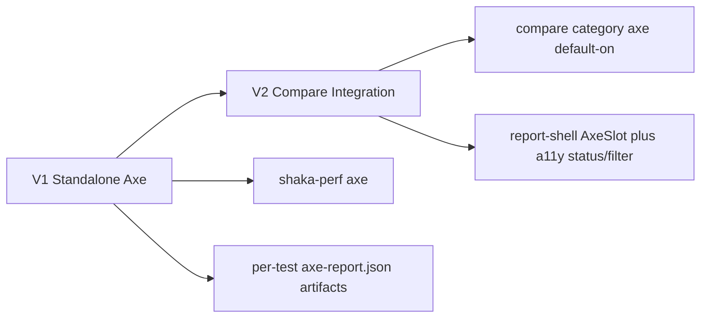

# Add `axe` AB Accessibility Part

## Decisions locked with user

- Scan **experiment server only** (no control diffing).
- **V1** ships as standalone `shaka-perf axe` command.
- **V2 starts immediately after V1** and integrates axe into `shaka-perf compare`.
- V2 includes full report integration (`a11y_violation`, dedicated slot, filters/pills) and axe default-on in compare.
- Runner should reuse visreg `preparePage(...)` semantics for AB behavior parity.
- Use full global/per-test axe config model with merge semantics from requirements.
- CI violation gating is configurable via `axe.failOnViolation` (default `true`).
- `options.axe.skip` should **hide** the axe slot for that test in report UI.

## Baseline architecture context

- Root CLI wiring lives in [`/Users/ramezweissa/code/shaka/shaka-bundle-size/packages/shaka-perf/src/cli.ts`](/Users/ramezweissa/code/shaka/shaka-bundle-size/packages/shaka-perf/src/cli.ts).
- Compare orchestration lives in [`/Users/ramezweissa/code/shaka/shaka-bundle-size/packages/shaka-perf/src/compare/run.ts`](/Users/ramezweissa/code/shaka/shaka-bundle-size/packages/shaka-perf/src/compare/run.ts).
- AB test discovery/filtering is shared via [`/Users/ramezweissa/code/shaka/shaka-bundle-size/packages/shaka-shared/src/load-tests.ts`](/Users/ramezweissa/code/shaka/shaka-bundle-size/packages/shaka-shared/src/load-tests.ts) and [`/Users/ramezweissa/code/shaka/shaka-bundle-size/packages/shaka-shared/src/compare-options.ts`](/Users/ramezweissa/code/shaka/shaka-bundle-size/packages/shaka-shared/src/compare-options.ts).
- Existing AB page preparation logic is in [`/Users/ramezweissa/code/shaka/shaka-bundle-size/packages/shaka-perf/src/visreg/core/util/preparePage.ts`](/Users/ramezweissa/code/shaka/shaka-bundle-size/packages/shaka-perf/src/visreg/core/util/preparePage.ts).

## Delivery model

## V1 plan (standalone command)

1. **CLI and dependency**
   - Add `@axe-core/playwright` to [`/Users/ramezweissa/code/shaka/shaka-bundle-size/packages/shaka-perf/package.json`](/Users/ramezweissa/code/shaka/shaka-bundle-size/packages/shaka-perf/package.json).
   - Add `axe` command registration in [`/Users/ramezweissa/code/shaka/shaka-bundle-size/packages/shaka-perf/src/cli.ts`](/Users/ramezweissa/code/shaka/shaka-bundle-size/packages/shaka-perf/src/cli.ts).
   - Create `packages/shaka-perf/src/axe/program.ts` with `--testPathPattern`, `--filter`, `--experimentURL`, `--config`.

2. **Schema and typing**
   - Extend [`/Users/ramezweissa/code/shaka/shaka-bundle-size/packages/shaka-perf/src/compare/config.ts`](/Users/ramezweissa/code/shaka/shaka-bundle-size/packages/shaka-perf/src/compare/config.ts) with `axe` global schema:
     - `viewports`, `tags`, `disableRules`, `includeRules`, `engineOptions`, `failOnViolation`.
   - Extend AB test options typing in [`/Users/ramezweissa/code/shaka/shaka-bundle-size/packages/shaka-shared/src/ab-test-registry.ts`](/Users/ramezweissa/code/shaka/shaka-bundle-size/packages/shaka-shared/src/ab-test-registry.ts) with `options.axe`:
     - `tags`, `disableRules`, `includeRules`, `viewports`, `skip`.
   - Implement merge semantics from requirements:
     - `tags`: replace, `disableRules`: union+dedup, `includeRules`: replace, `viewports`: replace.

3. **Runner**
   - Create `packages/shaka-perf/src/axe/run.ts`.
   - Load tests via `loadTests()` and execute against experiment URL only.
   - One browser per run; per test x viewport context/page runs with `asyncLimit` (default 2).
   - Reuse visreg `preparePage(...)` behavior so AB test setup is consistent.
   - Execute axe scan with tags/disable/include rules.
   - Persist per-test output as `<resultsRoot>/<slug>/axe-report.json` (full details).

4. **Failure behavior**
   - Engine/setup failures propagate clearly; no silent fallback defaults.
   - Exit code non-zero when `failOnViolation !== false` and violations exist, or when execution errors occur.
   - Emit structured summary output suitable for CI logs.

5. **Validation**
   - Verify against demo project and ensure typecheck/build/test pass.
   - Document standalone command usage and config examples.

## V2 plan (starts immediately after V1)

1. **Compare category and statuses**
   - Extend category and status types in [`/Users/ramezweissa/code/shaka/shaka-bundle-size/packages/shaka-perf/src/compare/report.ts`](/Users/ramezweissa/code/shaka/shaka-bundle-size/packages/shaka-perf/src/compare/report.ts):
     - `Category`: add `'axe'`
     - `Status`: add `'a11y_violation'`
   - Update `combineStatus` precedence in [`/Users/ramezweissa/code/shaka/shaka-bundle-size/packages/shaka-perf/src/compare/run.ts`](/Users/ramezweissa/code/shaka/shaka-bundle-size/packages/shaka-perf/src/compare/run.ts):
     - `error > regression > visual_change > a11y_violation > improvement > no_difference`

2. **Default-on compare integration**
   - Add `'axe'` to valid/default categories in [`/Users/ramezweissa/code/shaka/shaka-bundle-size/packages/shaka-perf/src/compare/cli/program.ts`](/Users/ramezweissa/code/shaka/shaka-bundle-size/packages/shaka-perf/src/compare/cli/program.ts) and [`/Users/ramezweissa/code/shaka/shaka-bundle-size/packages/shaka-perf/src/compare/run.ts`](/Users/ramezweissa/code/shaka/shaka-bundle-size/packages/shaka-perf/src/compare/run.ts).
   - Implement engine bridge + harvest for axe and support `--skip-engines` re-harvest.
   - Include a11y count in `summarizeFailures()`.

3. **Report shell**
   - Add `AxeSlot` and wire it into category rendering.
   - Add status labels/filter token for `a11y_violation`.
   - Render detailed rule/node help-url breakdown.
   - Apply payload truncation for embedded report JSON (`html` and `failureSummary`) to protect report size.
   - For `options.axe.skip === true`, hide the axe slot for that test (selected behavior).

4. **Acceptance checks**
   - `shaka-perf compare` runs axe by default.
   - `--categories visreg,perf` disables axe engine entirely.
   - `failOnViolation` semantics match requirements.
   - Engine failure isolation is per test when possible, with report-visible errors.

## Notes on requirement alignment

- This plan intentionally phases delivery, but still adopts the requirement model and starts V2 immediately after V1.
- Any further changes to skip-slot rendering, selector formatting, or additional flags should be confirmed before implementation.
