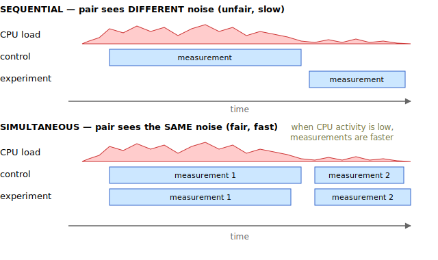
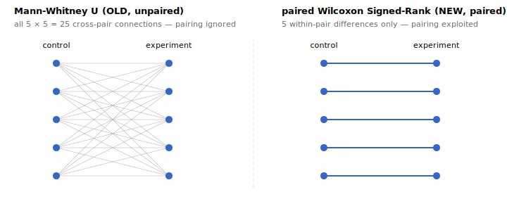

# Noise-Resistant Perf Tests — Experiment Study

Does switching from Mann-Whitney U to paired Wilcoxon **and**
paired-simultaneous sampling actually make perf-tests noise-resilient,
or is one of the two pieces doing all the work? Run the campaign, diff
the summaries, check if all predictions hold.

The core insight: a paired difference `d_i = exp[i] − ctrl[i]` only
cancels noise if the two samples in the pair *experienced the same
noise*. That requires sampling them at the same instant.





The PR couples two changes: sample control + experiment simultaneously,
*and* switch to paired stats that consume `d_i`. The study asks whether
both are necessary, or one alone is enough.

## Test-quality metrics

1. **False-regression count** in `noDifference_*` groups — lower is better.
2. **Mean p-value (detected)** in `regression_*` groups — lower is better.

Both land in `testData/SUMMARY.md` (generated by `UPDATE_TESTDATA=1 yarn jest noise-resilience`).

## Sampling conditions

Full 2×2 grid (sampling-mode × parallelism):

|              | par=1                                  | par=3                                 |
| ------------ | -------------------------------------- | ------------------------------------- |
| sequential   | sequentialSampling_singleProcess       | sequentialSampling_multiProcess       |
| simultaneous | simultaneousSampling_singleProcess     | simultaneousSampling_multiProcess     |

- **sequentialSampling_singleProcess** — `--sampling-mode sequential --parallelism 1` (pre-PR)
- **sequentialSampling_multiProcess** — `--sampling-mode sequential --parallelism 3` (parallelism, no pair-coupling)
- **simultaneousSampling_singleProcess** — `--sampling-mode simultaneous --parallelism 1` (pair-coupling, no parallelism)
- **simultaneousSampling_multiProcess** — `--sampling-mode simultaneous --parallelism 3` (current default)

## 16 campaign groups

| Group                                                          | Sampling     | Par | Noise  | Control URL              | Experiment URL                              |
| -------------------------------------------------------------- | ------------ | :-: | ------ | ------------------------ | ------------------------------------------- |
| `noDifference_LowNoise_sequentialSampling_singleProcess`       | sequential   |  1  | off    | `http://localhost:3030/` | `http://localhost:3030/`                    |
| `noDifference_LowNoise_sequentialSampling_multiProcess`        | sequential   |  3  | off    | `http://localhost:3030/` | `http://localhost:3030/`                    |
| `noDifference_LowNoise_simultaneousSampling_singleProcess`     | simultaneous |  1  | off    | `http://localhost:3030/` | `http://localhost:3030/`                    |
| `noDifference_LowNoise_simultaneousSampling_multiProcess`      | simultaneous |  3  | off    | `http://localhost:3030/` | `http://localhost:3030/`                    |
| `noDifference_HighNoise_sequentialSampling_singleProcess`      | sequential   |  1  | **on** | `http://localhost:3030/` | `http://localhost:3030/`                    |
| `noDifference_HighNoise_sequentialSampling_multiProcess`       | sequential   |  3  | **on** | `http://localhost:3030/` | `http://localhost:3030/`                    |
| `noDifference_HighNoise_simultaneousSampling_singleProcess`    | simultaneous |  1  | **on** | `http://localhost:3030/` | `http://localhost:3030/`                    |
| `noDifference_HighNoise_simultaneousSampling_multiProcess`     | simultaneous |  3  | **on** | `http://localhost:3030/` | `http://localhost:3030/`                    |
| `regression_LowNoise_sequentialSampling_singleProcess`         | sequential   |  1  | off    | `http://localhost:3030/` | `http://localhost:3030/?hydration_delay=10` |
| `regression_LowNoise_sequentialSampling_multiProcess`          | sequential   |  3  | off    | `http://localhost:3030/` | `http://localhost:3030/?hydration_delay=10` |
| `regression_LowNoise_simultaneousSampling_singleProcess`       | simultaneous |  1  | off    | `http://localhost:3030/` | `http://localhost:3030/?hydration_delay=10` |
| `regression_LowNoise_simultaneousSampling_multiProcess`        | simultaneous |  3  | off    | `http://localhost:3030/` | `http://localhost:3030/?hydration_delay=10` |
| `regression_HighNoise_sequentialSampling_singleProcess`        | sequential   |  1  | **on** | `http://localhost:3030/` | `http://localhost:3030/?hydration_delay=10` |
| `regression_HighNoise_sequentialSampling_multiProcess`         | sequential   |  3  | **on** | `http://localhost:3030/` | `http://localhost:3030/?hydration_delay=10` |
| `regression_HighNoise_simultaneousSampling_singleProcess`      | simultaneous |  1  | **on** | `http://localhost:3030/` | `http://localhost:3030/?hydration_delay=10` |
| `regression_HighNoise_simultaneousSampling_multiProcess`       | simultaneous |  3  | **on** | `http://localhost:3030/` | `http://localhost:3030/?hydration_delay=10` |

5 runs per group. Detection metric: `hydration-start`.

## Stats methods

- **NEW** (current, `5da18f5`): paired Wilcoxon Signed-Rank on
  `d_i = experiment[i] − control[i]`; Hodges-Lehmann point estimate =
  median of Walsh averages `(d_i + d_j) / 2`.
- **OLD** (pre-`5da18f5`): unpaired Mann-Whitney U via normal
  approximation; two-sample Hodges-Lehmann = median of the `n × n`
  cartesian differences `control[i] − experiment[j]`.

NEW exploits pairing (shared noise cancels in each `d_i`) but
misbehaves when pairs drift; OLD can't exploit pairing at all but is
drift-immune. Same `--pValueThreshold 0.01` gates significance in both,
held constant for the study.

## Predictions
This is written before te measurements, to check if my understanding is correct.
The main thing is I expect smaller p-values under noise for paired tests, but only whein sampling is simultaneous.

- **Q1.** HighNoise, regression, NEW: `simultaneousSampling_multiProcess` vs `sequentialSampling_singleProcess` mean p-value. Direction?
  simultaneousSampling_multiProcess should outperform sequentialSampling_singleProcess by a huge margin. The regression will be detected more frequently and with orders of magnitude smaller p-value.
- **Q2.** HighNoise, regression, NEW: `simultaneousSampling_multiProcess` vs `sequentialSampling_multiProcess`.
  same as Q1. simultaneousSampling_multiProcess should outperform sequentialSampling_multiProcess
- **Q3.** HighNoise, regression, NEW: `simultaneousSampling_singleProcess` vs `sequentialSampling_singleProcess`.
  simultaneousSampling_singleProcess should drastically outperform sequentialSampling_singleProcess
- **Q4.** HighNoise, regression, NEW: `simultaneousSampling_singleProcess` vs `simultaneousSampling_multiProcess`.
  roughly same performance expected
- **Q5.** HighNoise, noDifference, NEW: does `sequentialSampling_multiProcess` produce more false regressions than `sequentialSampling_singleProcess`/`simultaneousSampling_singleProcess`/`simultaneousSampling_multiProcess`?
  No difference actually. p-value threshould 0.01 should reduce false regressions to absolute minimum.
- **Q6 (control).** LowNoise.
  NEW stats: All four sampling conditions should be indistinguishable in terms of true and false regressions.
  OLD stats: simultaneousSampling_singleProcess (the best) == sequentialSampling_singleProcess > simultaneousSampling_multiProcess > sequentialSampling_multiProcess (the worst)
- **Q7.** HighNoise, regression, `simultaneousSampling_multiProcess`: NEW vs OLD mean p-value. Does paired stats help when pairs are locked?
  NEW should outperform OLD by a huge margin. In NEW the regression will be detected more frequently and with orders of magnitude smaller p-value.
- **Q8.** HighNoise, regression, `sequentialSampling_multiProcess`: NEW vs OLD. Paired stats should lose the edge (or lose) when pairs drift.
  No difference in performance. Both should perform badly.
- **Q9 (synthesis).** Bigger swing in mean p-value: (sequentialSampling_singleProcess→simultaneousSampling_multiProcess at NEW) or (OLD→NEW at simultaneousSampling_multiProcess)?
  Depends on noise. On low noise, sequentialSampling_singleProcess should be same as simultaneousSampling_multiProcess at NEW, however adding noise makes simultaneousSampling_multiProcess way better.
  Switching OLD→NEW at simultaneousSampling_multiProcess gives way better results at high noise, but still benefitial at low noise


## Procedure

### 1. Run the campaign (~4 hrs, quiet machine)

```bash
cd demo-ecommerce
yarn shaka-perf twins-build   # if needed
yarn shaka-perf twins-start
yarn build
../packages/shaka-perf/src/bench/run-noise-resilience-campaign.sh 20
```

Outputs land in `packages/shaka-perf/src/bench/testData/<group>/`. Don't
use the machine during the run.

### 2. Generate NEW-stats summary; commit

```bash
cd packages/shaka-perf
UPDATE_TESTDATA=1 yarn jest noise-resilience
```

This regenerates all `conclusion-*.txt` files and `SUMMARY.md`. Commit `testData/`.

### 3. Revert stats to OLD

```bash
git show 5da18f5 --stat
git checkout 5da18f5^ -- packages/shaka-perf/src/bench/stats \
                         packages/shaka-perf/src/bench/cli/compare/generate-stats.ts \
                         packages/shaka-perf/src/bench/cli/compare/compare-results.ts
yarn build
```

Do not revert sampling-mode, parallelism, process-isolation, or campaign-script commits.
Only revert canges in statistical methods.

### 4. Regenerate OLD-stats summary (no remeasurement)

```bash
cd packages/shaka-perf
UPDATE_TESTDATA=1 yarn jest noise-resilience
```

This regenerates conclusions and `SUMMARY.md` using the OLD stats — same measurements, different analysis.

### 5. Diff

```bash
git diff HEAD -- packages/shaka-perf/src/bench/testData/SUMMARY.md
git diff HEAD -- packages/shaka-perf/src/bench/testData
```

### 6. Check predictions Q1–Q9. Notice where your answers were wrong


