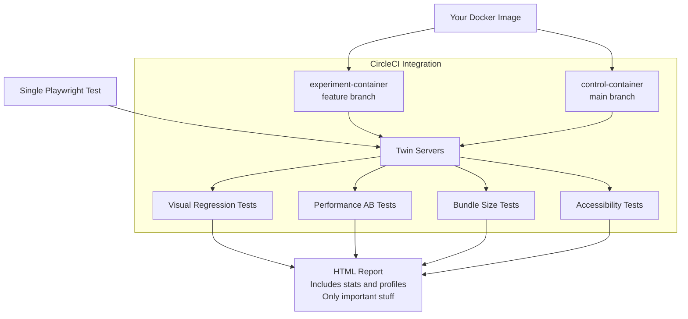

# shaka-perf
## The easiest way to test Frontend Performance
Do you want to improve `Lighthose` & `Web Vitals` without breaking your site?
`shaka-perf` will measure the impact of your PRs on performance and detect visual changes.
It also auto-detects SEO and accessibility issues, and it's extremely easy to setup.
This is the only benchmarking toolset your web site needs.


In order to use `shaka-perf`, you need to create a Docker image with a production-local server and some Playwright tests. `shaka-perf` will magically transform it to:
* Statistically significant performance AB tests
* Visual Regression tests (screenshot comparison of main vs feature branches on multiple screen sizes)
* Comprehensive bundle-size regression check
* Accessibility tests
* HTML reports
* CircleCI integration
* Automatic regression detection in the main branch

This is a chef's kiss toolset for quick performance optimization without the risk of breaking things down!



## Why choose `shaka-perf`?
1. **One test to rule them all**. Write a Playwright test once — get performance benchmarks, visual regression, accessibility audits, and network-activity tracking from the same `abTest` definition.
2. **Statistically sound, adjusted for CPU noise.**. Unlike when using other performance benchmarks, you don't have to reduce CPU noise. Control and experiment are sampled *simultaneously* so they hit the same instant of CPU activity, then analyzed with a paired Wilcoxon Signed-Rank test + paired Hodges-Lehmann estimator, with exact-distribution p-values at small n. You don't need a quiet machine, a dedicated CI box — shared noise cancels inside each pair. This make perf-tests extremely cheap and easy to setup. No other open-source web-perf toolkit we could find (such as TracerBench, sitespeed.io) combines noise-aligned sampling with paired statistics this way. See [used_statistics.md](./packages/shaka-perf/used_statistics.md) for the justification of the methods used. 
3. **True A/B isolation**. Control and experiment run simultaneously in separate Docker containers from separate git branches. No "run before, run after, hope nothing changed" — actual side-by-side comparison.
4. **~2 hours to full setup**. Write a Dockerfile, a short config, some Playwright tests, done. Works both locally and on CI.
5. [WIP] **CI-native at scale**. Designed for parallel measurement collection across CI nodes and processes. 
6. [WIP] **Auto-bisect regressions**. Point it at a commit range, it finds exactly which commit caused the regression. No manual binary search.
8. [WIP] **Actually convenient Accessibility testing**. Doesn't just dump violations — maintains a structured allow-list baseline. CI fails only on new issues onl;y.

## TODO: host a demo with all the performance artifacts (Combine with RSC demo by Abanoub)

## Packages

| Package                                            | Description                                                        |
| ---------------------------------------------------| -------------------------------------------------------------------|
| [shaka-perf](./packages/shaka-perf)                | Unified CLI: benchmarking, visual regression, twin-servers         |
| [shaka-bundle-size](./packages/shaka-bundle-size)  | Bundle size diffing and analysis using loadable components         |

## Installation

```bash
yarn add shaka-perf
yarn add shaka-bundle-size
```

## To get started

```bash
yarn install
yarn build
```

## Publishing a New Version

Each package is published independently using git tags. To publish a new version:

1. Update the version in the package's `package.json`
2. Commit the change
3. Create and push a git tag with the format `package-name@version`

```bash
# Example: publishing shaka-bundle-size version 1.2.0
git tag shaka-bundle-size@1.2.0
git push origin shaka-bundle-size@1.2.0
```

The GitHub Action will automatically build and publish the package to npm.

## License

MIT
