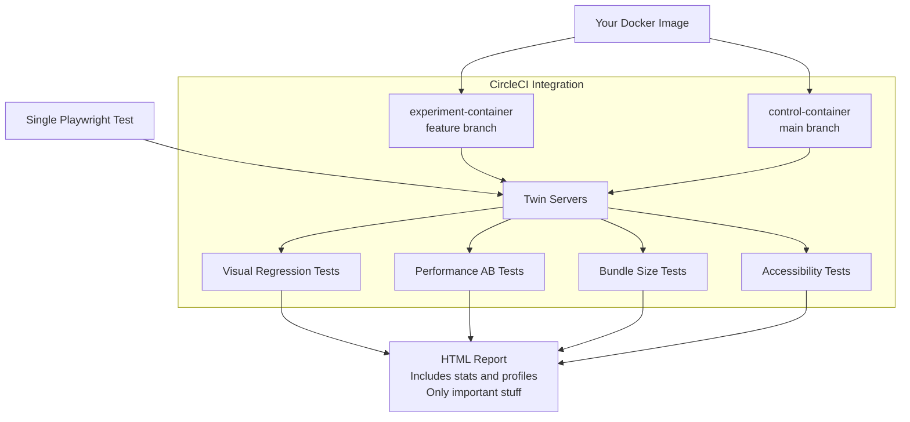

# shaka-perf
## The easiest way to test Frontend Performance
Do you want to improve `Lighthose` & `Web Vitals` without breaking your site?
`shaka-perf` will measure the impact of your PRs on performance and detect visual changes.


In order to use it, you need to create a Docker image with a production-local server and some Playwright tests. `shaka-perf` will magically transform it to:
* Statistically significant performance AB tests
* Visual Regression tests (screenshot comparison of main vs feature branches on multiple screen sizes)
* Comprehensive bundle-size regression check
* Accessibility tests
* HTML reports
* CircleCI integration
* Automatic regression detection in the main branch

This is a chef's kiss toolset for quick performance optimization without the risk of breaking things down!



## Packages

| Package                                            | Description                                                        |
| ---------------------------------------------------| -------------------------------------------------------------------|
| [shaka-bundle-size](./packages/shaka-bundle-size)  | Bundle size diffing and analysis using loadable components         |
| [shaka-twin-servers](./packages/shaka-twin-servers)| Identical servers main vs. feature branch running side by side     |
| [shaka-bench](./packages/shaka-bench)              | Benchmarking tools                                                 |
| [shaka-visreg](./packages/shaka-visreg)            | Visual regression testing tools                                    |

## Installation

```bash
yarn add shaka-bundle-size
yarn add shaka-twin-servers
yarn add shaka-bench
yarn add shaka-visreg
```

## To get started

```bash
yarn install
yarn build
```

## Publishing a New Version

Each package is published independently using git tags. To publish a new version:

1. Update the version in the package's `package.json`
2. Commit the change
3. Create and push a git tag with the format `package-name@version`

```bash
# Example: publishing shaka-bundle-size version 1.2.0
git tag shaka-bundle-size@1.2.0
git push origin shaka-bundle-size@1.2.0
```

The GitHub Action will automatically build and publish the package to npm.

## License

MIT
