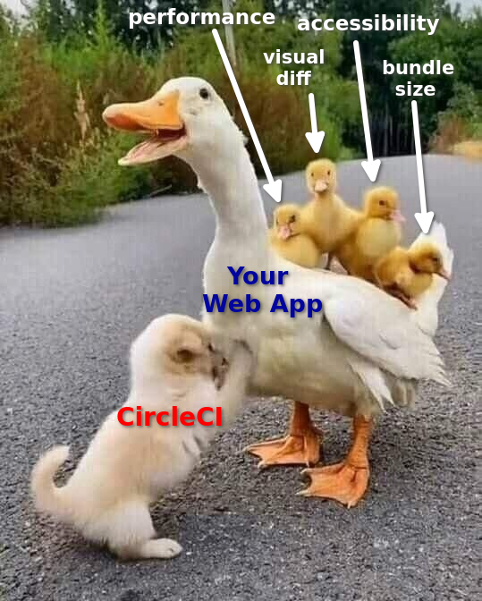
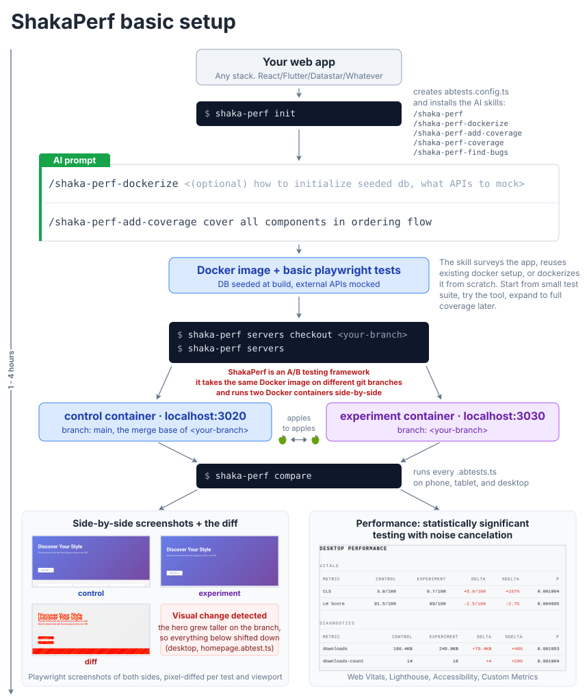
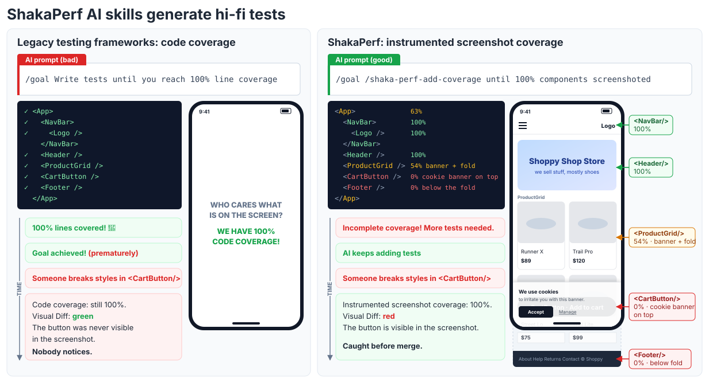
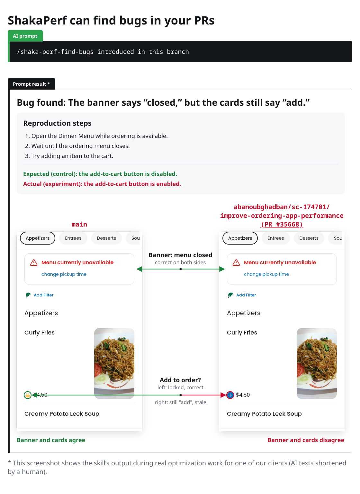

# shaka-perf

## The easiest way to test Frontend Performance
Do you want to improve `Lighthouse` & `Web Vitals` without breaking your site?
`shaka-perf` will measure the impact of your PRs on performance and detect visual changes.
It also auto-detects SEO and accessibility issues, and it's extremely easy to setup.
This is the only benchmarking toolset your web site needs.


## High-level architecture diagram


ShakaPerf is a chef's kiss toolset for quick performance optimization or it can be your AI-driven QA Engineer.


Shakaperf is extremely qute and easy to set up.

## Usage

Setting up takes one to four hours. Install, then let the bundled Claude Code skills do the Docker work:

```bash
# small helpers and types
yarn add shaka-shared
# or
npm i shaka-shared

# install shaka-perf globally
npm i -g shaka-perf       # you may use yarn, or have a local installation, but this is not recommended
shaka-perf init           # creates abtests.config.ts and installs the AI skills
```

In Claude Code, run the two prompts:
```bash
# ~30 minutes
/shaka-perf-dockerize # Optionally provide details about how to seed your app (e.g. instruct it to visit your production site with playwright-mcp and re-use the data)

# start small, expand later. ~30 minutes
/shaka-perf-add-coverage write a mimimal test suite. Add seeded data if needed.
```

Then run the same image as two containers, `control` on the merge base of your branch and `experiment` on your branch, and compare them:

```bash
shaka-perf servers checkout <your-branch>
shaka-perf servers   # builds both images, starts both containers, launches the app on each side
shaka-perf compare   # runs every test on phone, tablet, and desktop against both sides

# or if you are not interested in performance and a11y
shaka-perf compare --categories=visreg # way faster
```

`compare` writes `compare-results/report.html` with side-by-side screenshots plus the pixel diff, and a statistically significant performance comparison of Web Vitals, Lighthouse, accessibility, and custom metrics.



### Performance Optimization

Now you can start optimizing your pages. (~1 hour)
```
/goal run shaka-perf audit and read sources to find the largest bottleneck. Minimal change should produce maximum result.

Before announcing the victory, ensure all the affected components are screenshot-covered /shaka-perf-add-coverage
```

Or something more ambitous (2-8 hours)
```
/goal

1. /shaka-perf-add-coverage ensure screenshot coverage of all components
2. Switch the stack to React RSC
3. Subagent with /shaka-perf-find-bugs should not find anything critical
4. No visual changes
5. When done, hit me up with performance comparison report from shaka-perf
```

## Why choose `shaka-perf`?
1. **One test to rule them all**. Write a Playwright test once - get performance benchmarks, visual regression, accessibility audits, and network-activity tracking from the same `abTest` definition.
2. **Statistically sound, adjusted for CPU noise.** Unlike when using other performance benchmarks, you don't have to reduce CPU noise. Control and experiment are sampled *simultaneously* so they hit the same instant of CPU activity, then analyzed with a paired Wilcoxon Signed-Rank test + paired Hodges-Lehmann estimator, with exact-distribution p-values at small n. You don't need a quiet machine, a dedicated CI box - shared noise cancels inside each pair. This makes perf tests extremely cheap and easy to setup. No other web-perf toolkit we could find (such as TracerBench, sitespeed.io) combines noise-aligned sampling with paired statistics this way. See [used_statistics.md](./packages/shaka-perf/used_statistics.md) for the justification of the methods used.
3. **True A/B isolation**. Control and experiment run simultaneously in separate Docker containers from separate git branches. No "run before, run after, hope nothing changed" - actual side-by-side comparison.
4. **~2 hours to full setup**. Write a Dockerfile, a short config, some Playwright tests, done. Works both locally and on CI.
5. [WIP] **CI-native at scale**. Designed for parallel measurement collection across CI nodes and processes. 
6. [WIP] **Auto-bisect regressions**. Point it at a commit range, it finds exactly which commit caused the regression. No manual binary search.
8. [WIP] **Actually convenient Accessibility testing**. Doesn't just dump violations - maintains a structured allow-list baseline. CI fails only on new issues.

## Instrumented screenshot coverage makes AI generated tests work

`shaka-perf init` installs Claude Code skills generating hi-fi tests. If any component in the app changes no matter how deap in the tree, shaka-perf will screenshot it and alert you. This works without needing you to polish the tests manually.


## Shakaperf can be used as AI QA-Engineer. Minimal amount of false positives.

The `shaka-perf-find-bugs` skill turns twin-servers into a QA rig: agents use the control server to generate the `expected/actual` screenshots. `shaka-perf init` installs it next to the other skills.



## TODO: host a demo with all the performance artifacts (Combine with RSC demo by Abanoub)

## Publishing a New Version

use skill `/deploy shaka-perf shaka-shared`

## License
[](./LICENSE.md) 

TL;DR: free for orgs under 10 people, $1M revenue, and $1M raised, and for charities, schools, and hospitals at any size. Otherwise a [subscription](https://shakaperf.com/pricing).

Registration is free, optional, and encouraged for every organization:
[shakaperf.com/license](https://shakaperf.com/license). Questions:
[contact@shakacode.com](mailto:contact@shakacode.com).
